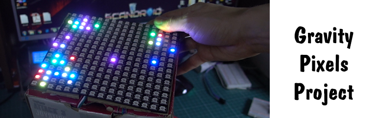

# kub
<html>
<head>
”правление матрицей 8х8 WS2812
</head>
<body>

<h1>ћатематическа€ модель шариков на плоскости</h1>

ќписание проекта

ћатрица адресных светодиодов, имитирующа€ движение шариков по наклонной плоскости

ѕодробности в видео: https://youtu.be/dueJTClX7c4

  

  
Ётот текст зеленый
  
<b>ѕросто пример жирного текста</b>
  
—хема

  
¬ данном примере мы рассмотрели кратко основные теги HTML, теперь можно пробовать создавать 
несколько св€занных страниц через ссылки и выкладывать сайт в интернет.

Ётот материал был написан благодар€ сайту 
<a href=http://zarabotat-na-sajte.ru/>
http://zarabotat-na-sajte.ru/</a> - за что € ему благодарен. 
  
—пасибо. ƒо новых встреч!
</body>
</html>